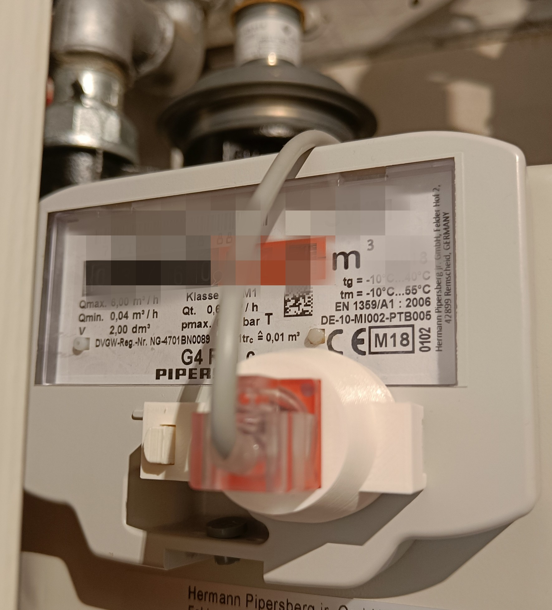
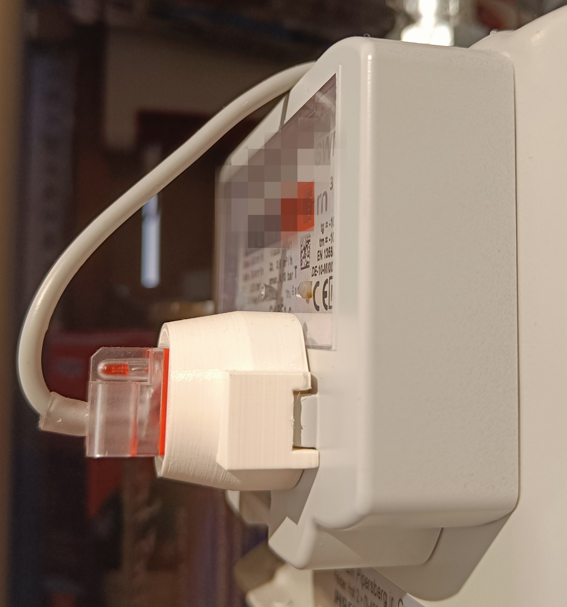
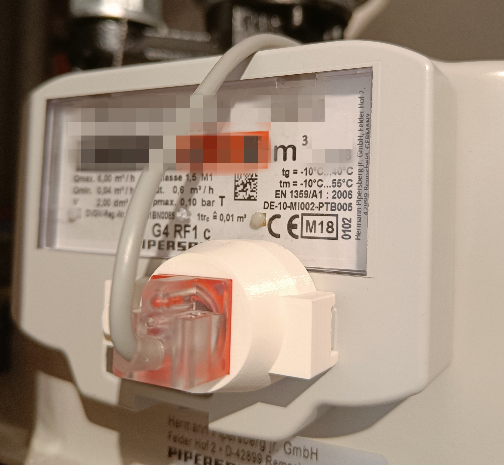
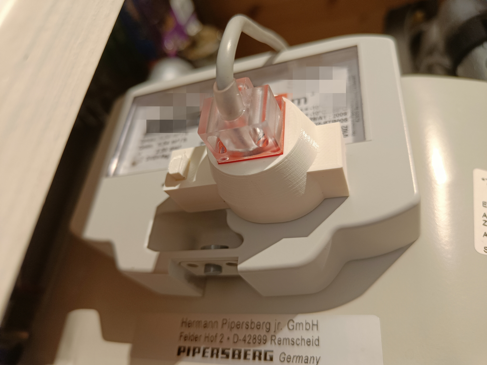
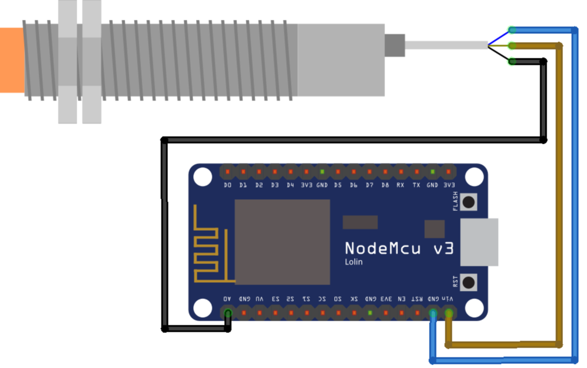

# Gas Meter Sensor

This project implements a cheap and easy way to read out meter pulses from the Pipersberg G4 RF1 c gas meter via an Espressif [ESP8266](https://www.espressif.com/en/products/socs/esp8266) micrcontroller and a PL-05N proximity sensor. The meter reading can be calculated and stored locally and used by a [Home Assistant](https://www.home-assistant.io/) instance using [ESPHome](https://esphome.io/index.html).

## Prerequisites

### Hardware

The following hardware is needed to implement this project
- ESP8266 NodeMCUv3 (or similar, e.g. Wemos D1)
- PL-05N NPN Contact DC Proximity Sensor Switch
  - Alternative: LJ12A3-4-Z/AY, but needs more space in front of gas meter. See NOTE in sensor holder for a suitable holder.

### Software / Infrastructure

- Home Assistant running on a server
- ESPHome running on a server

### Sensor holder

The 3D printing files for the sensor holder can be found in the [holder](holder) folder or on [Thingiverse](https://www.thingiverse.com/thing:5856718).

NOTE: The design is a remix of [a sensor holder for LJ12A3-4-Z/AY](https://www.thingiverse.com/thing:5160100).

#### Render of the holder

  

#### Photos of real setup

  
   

   
  

### Wiring

The cable colors of (inductive) sensors, seem to deviate from the standard colors, especially with blue for GND and brown for (VIN) power supply. Please connect the sensor to the NodeMCU v3 as follows. 

| ESP8266 NodeMCU v3 | PL-05N |
|:-------------------|:-------|
| VIN (5V)           | brown  |
| GND                | blue   |
| A0 (Analog)        | black  | 

   

NOTE: The PL-05N is rated for input voltages from 10V to 30V. However, I found that it is working perfectly fine with the 5V voltage supply sketched above. If in doubt, please add a buck-boost converter to the brown cable to reach 10V.

## Software

In the following sections, the software setup will be described.

### ESPHome Sensor

One of the easiest ways to connect an ESP8266 to Home Assistant is using ESPHome. The basic firmware can be easily flashed from the browser connecting the device to the computer. Afterwards, the configuration can be easily updated over Wifi.

I am using 
* an [analog to digital sensor](https://esphome.io/components/sensor/adc.html) to measure the raw voltage on pin A0
* an [analog threshold binary sensor](https://esphome.io/components/binary_sensor/analog_threshold.html) with the threshold set to 0.3V to trigger a pulse
* a [template sensor](https://esphome.io/components/sensor/template.html) to convert the pulses to the m³ consumer locally and to expose this value to Home Assistant

Please see the [ESPHome configuration for PL-05N](software/esphome-sensor-config/esphome-gas-meter-sensor-manual.yml) for all details.

NOTE: I tried using the [GPIO binary sensor](https://esphome.io/components/binary_sensor/gpio.html) on a digital GPIO pin before but encountered a lot of misreadings. Even with different `pullup` and `filters` using `delayed_on` I was not able to fix them.

### Home Assistant

Home Assistant should automatically be able to find the new sensor when it is connected to the same network.

#### Conversion to energy and gas cost

To convert the gas meter reading in m³ to energy (kWh) and cost (€), please see [packages/gas-meter.yaml](software/homeassistant/packages/gas_meter.yaml).

Basically, the gas meter reading in m³ is converted to kWh via a factor which can be requested by the gas supplier or is part of the gas bill. The gas cost is calculated via the gas concumption in kWh multiplied by the gas price in €/kWh. The current gas price can be set via a input number.

### Gas consumption statistics

With the meter reading in m³, kWh and € you can already use some basic built-in Home Assistant statistics. However, if you want to keep statistics for time frames such as yesterday, last week or last month, a bit more effort is needed.

See [packages/gas_statistics.yaml](software/homeassistant/packages/gas_statistics.yaml) for all details.

# License

This project is under MIT license. See [LICENSE.md](LICENSE.md).